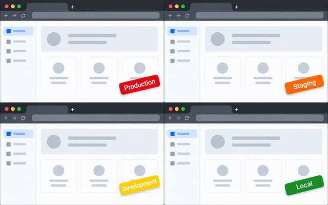
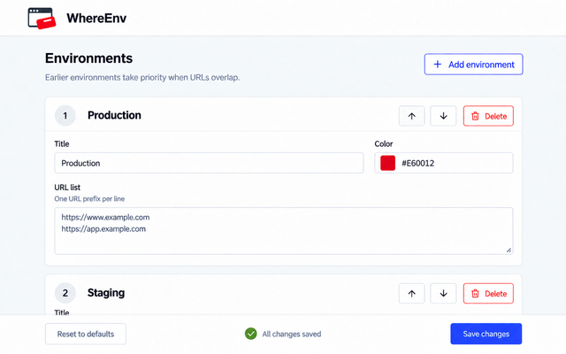

# WhereEnv

A Chrome extension that makes website environments recognizable at a glance with colored sticky labels.

## Features

- Display custom labels and colors based on URL prefixes.
- Add, delete, and reorder environments to set matching priority.
- Fade labels when the pointer approaches them, while allowing clicks through.

## Usage

Click the extension icon to open settings. Configure each environment's title, color, and URL prefixes (one per line), then save. Earlier environments take priority when URLs overlap.

## Development

Run `make` to create `package.zip`, or `make format` to format the source files with Prettier.
